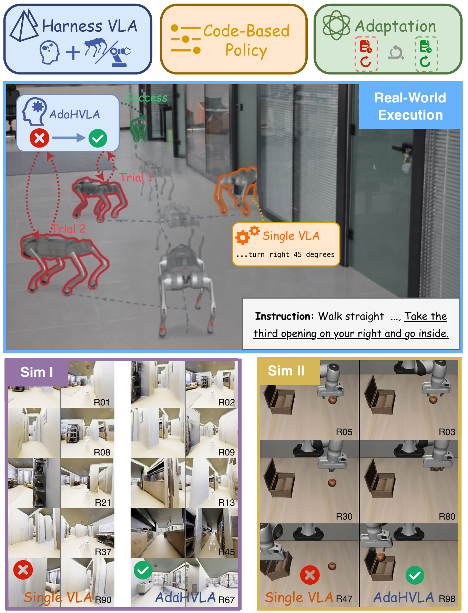
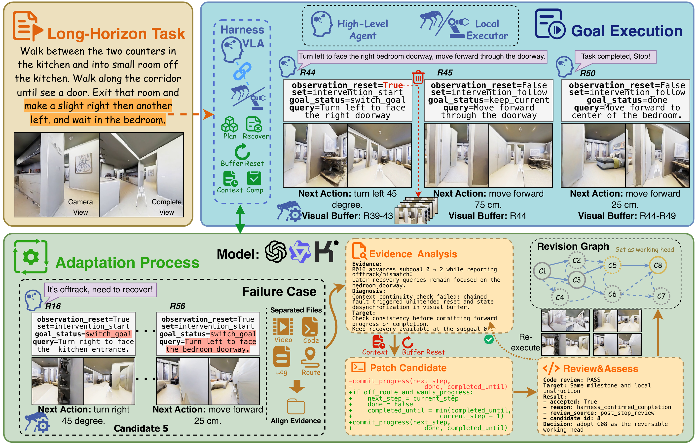
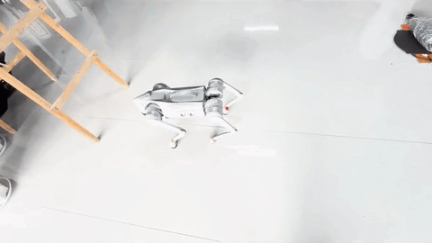
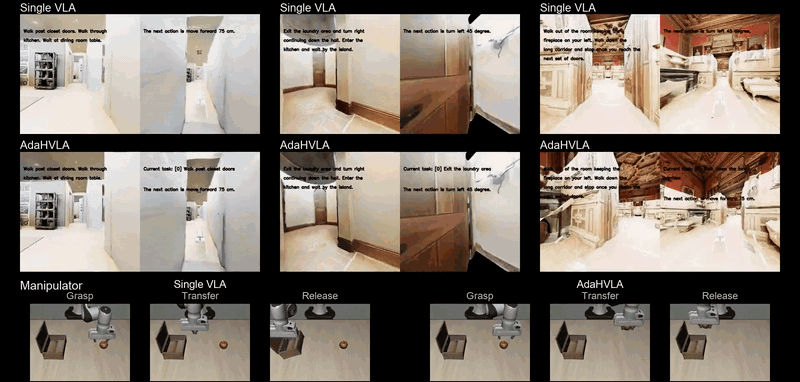

<div align="center">

# AdaHVLA

### Adaptive Harnesses for Long-Horizon Vision-Language-Action Execution

The preprint of our paper is coming soon.

[Overview](#overview) · [Demos](#demos) · [Getting started](#getting-started) · [Running adaptation](#running-adaptation) · [Customizing the harness](#customizing-the-harness) · [Acknowledgments](#acknowledgments)

<table>
  <tr>
    <td width="58%" valign="top">
      <p>
        AdaHVLA connects task-level reasoning and memory with
        vision-language-action (VLA) execution through an adaptive
        harness. The harness maintains task state, constructs local
        instructions and visual context, and coordinates task progress,
        recovery, and completion across successive VLA calls.
      </p>
      <p>
        Between rollouts, a multiagent adaptation process turns execution
        evidence into coordination hypotheses and code revisions, then
        assesses their effects in subsequent rollouts. A revision graph
        retains candidate harnesses and their observed effects to guide
        further adaptation. This allows the executable rules governing
        task coordination to evolve through interaction with the
        environment.
      </p>
      <h2>Overview</h2>
      <p>
        This release provides a <strong>Go2 simulation navigation</strong>
        implementation, including a sample harness, the multiagent
        adaptation loop, a NaVILA adapter, a locomotion controller,
        simulator assets, and the 50-episode <code>navila-LH</code> dataset.
      </p>
      <p>
        The code supports prototype execution, iterative harness
        revision, and held-out evaluation, with candidate source
        snapshots and rollout evidence retained for inspection.
        Manipulation and real-robot adapters are coming in the future.
      </p>
    </td>
    <td width="42%" valign="top" align="center">
      
      <p>
        <em>
          Figure 1. Tasks, environments, and robotic platforms
          studied in the paper.
        </em>
      </p>
    </td>
  </tr>
</table>

<p align="center">
  
</p>

<p align="center">
  <em>
    Figure 2. Harness execution and adaptation from rollout evidence.
  </em>
</p>

## Demos

Excerpts from the submission video at its original playback speed.

### Real-world execution



*Multi-stage quadruped navigation, including the robot view and comparisons with Single VLA and harness revisions.*

### Simulation

Three navigation tasks with Single VLA above AdaHVLA; manipulation comparisons at grasp, transfer, and release along the bottom.



## Getting started

Run commands from the **AdaHVLA project root**. Full execution requires two Python environments, an NVIDIA GPU, and a vision-capable reasoning API.

### 1. Check the source and assets

The offline check requires Python 3.10+; no GPU or API is needed:

```bash
cd /path/to/AdaHVLA
python -m pip install -r requirements.txt
bash scripts/run.sh --check
```

This checks asset hashes, episode selections, and the prototype interface without starting the simulator or creating an experiment. Bundled resources include:

```text
benchmarks/navila-LH/dataset.json.gz   # 50 episodes
assets/locomotion/go2/policy.jit       # inference controller
assets/robots/go2/                    # robot USD and meshes
assets/matterport/<scene>/            # six scenes with textures
assets/manifest.json                  # provenance and SHA-256 hashes
```

Keep scene textures alongside their USD files. The assets and environment build on [NaVILA-Bench](https://github.com/yang-zj1026/NaVILA-Bench) and [VLN-CE-Isaac](https://huggingface.co/datasets/Zhaojing/VLN-CE-Isaac).

### 2. Install the simulation environment

The simulation baseline follows [NaVILA-Bench's installation requirements](https://github.com/yang-zj1026/NaVILA-Bench#installation): **Python 3.10, Isaac Sim 4.1.0, and the NaVILA Isaac Lab 1.1.0 fork**. Use Ubuntu 22.04 or later for this pip-based setup, with a compatible NVIDIA GPU and driver.

```bash
conda create -n adahvla-isaac python=3.10 -y
conda activate adahvla-isaac

cd /path/to/AdaHVLA
git clone https://github.com/yang-zj1026/IsaacLab.git /path/to/IsaacLab
ISAACLAB_ROOT=/path/to/IsaacLab bash scripts/setup_locomotion.sh
```

The helper installs Lab core and [`requirements-locomotion.txt`](requirements-locomotion.txt), then runs `pip check`. It defaults to PyTorch 2.2.2 with CUDA 12.1 wheels; set `ADAHVLA_CUDA=cu118` for CUDA 11.8. Simulation timing and asset paths are in [`configs/locomotion.json`](configs/locomotion.json); relative paths resolve from the project root.

### 3. Start the NaVILA server

Install NaVILA in a **separate environment** following the [NaVILA repository](https://github.com/AnjieCheng/NaVILA) and [Isaac evaluation setup](https://github.com/yang-zj1026/NaVILA-Bench#vla-evaluation). Download the [NaVILA Llama-3 8B, 8-frame checkpoint](https://huggingface.co/a8cheng/navila-llama3-8b-8f); model weights are not bundled.

In **terminal A**:

```bash
conda activate navila
PYTHONPATH=/path/to/AdaHVLA/src${PYTHONPATH:+:$PYTHONPATH} \
  python -m adahvla.vla \
  --model-path /path/to/navila-llama3-8b-8f \
  --host 127.0.0.1 --port 54321 --device cuda
```

Wait for `NaVILA listening` and keep the server running. Its socket protocol has no authentication; use loopback or a trusted private connection such as an SSH tunnel.

### 4. Configure the reasoning API

In **terminal B**:

```bash
conda activate adahvla-isaac
cd /path/to/AdaHVLA

export ADAHVLA_BASE_URL="https://your-api-endpoint/v1"
export ADAHVLA_MODEL="your-vision-model"
read -rs -p "API key: " ADAHVLA_API_KEY; echo
export ADAHVLA_API_KEY
```

The endpoint must support Chat Completions, image inputs, JSON object responses, and `temperature=0`. The online harness and adaptation agents share this configuration with separate contexts. The key is passed through the environment; do not commit credentials.

| Variable | Purpose / default |
| --- | --- |
| `ADAHVLA_API_KEY` | Your API credential |
| `ADAHVLA_BASE_URL` | API base URL, usually ending in `/v1` |
| `ADAHVLA_MODEL` | Vision-capable model with JSON output |
| `ADAHVLA_VLA_HOST` / `ADAHVLA_VLA_PORT` | NaVILA address: `127.0.0.1` / `54321` |
| `ADAHVLA_PYTHON` | Runner Python executable: `python` |

## Running adaptation

Verify the API–NaVILA–simulator connection with one prototype rollout:

```bash
bash scripts/run.sh --prototype-only
```

Then continue through adaptation and held-out evaluation:

```bash
bash scripts/run.sh
```

The second command also works directly and evaluates the prototype first. Defaults use **episode 27 for adaptation, 124 for validation, and 167 for held-out testing**. These are small example selections, not the paper's full evaluation or an upstream benchmark protocol. IDs refer to **`episode_id`**, not row numbers or `episode_new_id`.

Choose disjoint episode sets and a new output directory for a separate experiment:

```bash
bash scripts/run.sh \
  --train-ids 27,124 \
  --validation-ids 167 \
  --test-ids 191 \
  --max-steps 16 --max-candidates 4 --max-rollouts 12 \
  --output-dir ../AdaHVLA-runs/experiment-01
```

| Option | Limit | Default |
| --- | --- | --- |
| `--max-steps` | Manager scheduling steps | `16` |
| `--max-candidates` | Revision attempts | `4` |
| `--max-rollouts` | Adaptation rollout attempts | `12` |
| `--width` / `--depth` | Local revision search | `2` / `2` |
| `--max-decisions` | Harness decisions per episode | `128` |
| `--max-episode-seconds` | Simulated seconds per episode | `180` |
| `--rollout-timeout` | Wall-clock seconds per simulator process | `7200` |

Held-out episodes run after selection, outside the adaptation rollout budget. Use `--test-ids ""` to skip them. See `bash scripts/run.sh --help` for all options.

### Outputs and resuming

Output directories must be outside the source tree. The default is `../AdaHVLA-runs/navila-LH/`:

```text
adaptation.json                   # configuration and adaptation state
selected.json                     # selected candidate and source hash
candidates/C0000/adahvla/          # prototype source snapshot
candidates/C0001/adahvla/          # revised candidate source
checks/                           # source and interface check results
rollouts/R0001/evidence.json       # adaptation rollout evidence
rollouts/R0001/images/             # timestamped observations
rollouts/R0001/output/process.log  # simulator output
rollouts/T0001/                    # held-out evaluation evidence
```

Resume with the **same arguments and output directory**; completed prototype rollouts are reused. Failed or interrupted evaluations may consume an attempt. Use one runner per directory, and start a new directory when changing episode sets, model configuration, budgets, or fixed evaluation code. Held-out execution still calls the reasoning API, but makes no further code revisions.

## Customizing the harness

**The provided harness is a sample implementation. Write and optimize it for your robot, observations, task structure, and completion criteria.** In [`harness.py`](src/adahvla/harness.py), start with `DECISION_PROMPT`, `ContextPolicy`, `ProgressPolicy`, and `HandoffPolicy`. Validate changes on representative rollouts before adaptation and reserve separate episodes for testing.

| File | What to change |
| --- | --- |
| [`harness.py`](src/adahvla/harness.py) | Prompts, memory, progress, recovery, and execution guidance |
| [`adaptation.py`](src/adahvla/adaptation.py) | Agent roles, revision workflow, selection, and budgets |
| [`workspace.py`](src/adahvla/workspace.py) | Candidate checks, evaluation subprocesses, and evidence storage |
| [`vla.py`](src/adahvla/vla.py) | VLA client/server adapter |
| [`locomotion.py`](src/adahvla/locomotion.py), [`configs/`](configs/) | Robot controller and simulator integration |
| [`evaluate.py`](scripts/evaluate.py) | Episode execution and task metrics |

Other robots require matching executor and environment interfaces. Candidate checks and source hashes provide integrity checks, not an OS security sandbox.

## Evaluation and tests

Success requires harness-declared completion and a final **3D Euclidean goal distance strictly below the goal radius**. This endpoint metric does not verify every intermediate subgoal and is not official navigation SR, geodesic distance, or SPL. Ground-truth goals and reference trajectories are excluded from online harness inputs. The release does not include the paper's full experiment configurations or result archive.

Run the offline software tests:

```bash
PYTHONDONTWRITEBYTECODE=1 PYTHONPATH=src \
  python -m unittest discover -s tests -v
```

Controller tests require PyTorch. Tests check software behavior; validate the complete simulator/API setup and navigation performance in your deployment environment.

## Acknowledgments

We build on **[NaVILA: Legged Robot Vision-Language-Action Model for Navigation](https://arxiv.org/abs/2412.04453), RSS 2025**, and thank its authors for the models and resources. We also use [NaVILA-Bench](https://github.com/yang-zj1026/NaVILA-Bench), [VLN-CE-Isaac](https://huggingface.co/datasets/Zhaojing/VLN-CE-Isaac), [Matterport3D](https://niessner.github.io/Matterport/), [legged-loco](https://github.com/yang-zj1026/legged-loco), and [NaVILA's Isaac Lab fork](https://github.com/yang-zj1026/IsaacLab). Asset provenance is recorded in [`assets/manifest.json`](assets/manifest.json).

## License

AdaHVLA's original code is licensed under [Apache-2.0](LICENSE). Third-party code, assets, datasets, and model weights retain their upstream terms; see [`THIRD_PARTY_NOTICES.txt`](THIRD_PARTY_NOTICES.txt).
